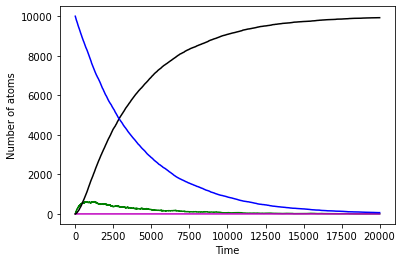

# #1


```python
import random
```


```python
import random

def letsmakeadeal():
    numgames = 1000
    win_by_switch = 0
    print()
    for game in range(numgames):
        winning_door = random.randint(1,3)
        chosen_door = random.randint(1,3)
        open_door = random.randint(1,3)
        while open_door == winning_door or open_door == chosen_door:
            open_door = random.randint(1,3)
        choice = random.randint(1,3)
        while choice == open_door or choice == chosen_door:
            choice = random.randint(1,3)
        if choice == winning_door:
            win_by_switch += 1
    switch_prob = (win_by_switch/numgames)*100
    print("Winning by switching probability: ",switch_prob, '%')
    stay_prob = ((numgames-win_by_switch)/numgames)*100
    print("Winning by staying probability: ", stay_prob, '%')
        
letsmakeadeal()
```

    
    Winning by switching probability:  64.0 %
    Winning by staying probability:  36.0 %


# #2


```python
from random import random
from numpy import arange
from pylab import plot,xlabel,ylabel,show

def p(tau):
    return 1 - 2**(-h/tau)

h = 1.0            
tmax = 20000

Bi209_num = 0

Pb_num = 0
Pb_tau = 3.3 * 60 
Pb_p = p(Pb_tau)

Tl_num = 0
Tl_tau = 2.2 * 60
Tl_p = p(Tl_tau)

Bi213_num = 10000
Bi213_tau = 46 * 60
Bi213_p = p(Bi213_tau)

time_points = arange(0.0,tmax,h)
Pb_points = []
Bi209_points = []
Tl_points = []
Bi213_points = []

for time in time_points:
    Pb_points.append(Pb_num)
    Bi209_points.append(Bi209_num)
    Tl_points.append(Tl_num)
    Bi213_points.append(Bi213_num)
    decay1= 0
    decay2 = 0
    decay3=0
    for i in range(Pb_num):
        if random()<Pb_p:
            decay1 += 1
    Pb_num -= (decay1)
    Bi209_num += (decay1)
    for j in range(Tl_num):
        if random() < Tl_p:
            decay2 += 1
    Tl_num -= (decay2)
    Pb_num += (decay2)
    for m in range(Bi213_num):
        if random() < Bi213_p:
            decay3 += 1
    Bi213_num -= decay3
    Pb_num += round(decay3*0.9791)
    Tl_num += round(decay3*0.0209)

plot(time_points, Pb_points, c = 'g')
plot(time_points, Tl_points ,c= 'm')
plot(time_points, Bi209_points,c='k')
plot(time_points, Bi213_points,c='b')
xlabel("Time")
ylabel("Number of atoms")
show()
```




